# LoRA Power-Merger ComfyUI

Advanced LoRA merging for ComfyUI with Mergekit integration, supporting 8+ merge algorithms including TIES, DARE, SLERP, and more. Features modular architecture, SVD decomposition, selective layer filtering, and comprehensive validation.

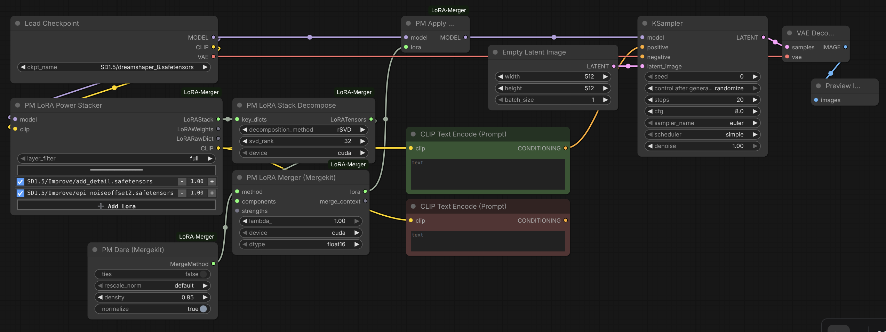

This is an enhanced fork of laksjdjf's [LoRA Merger](https://github.com/laksjdjf/LoRA-Merger-ComfyUI) with extensive refactoring and new features. Core merging algorithms from [Mergekit](https://github.com/arcee-ai/mergekit) by Arcee AI.

## Features

- **8+ Merge Algorithms**: Task Arithmetic, TIES, DARE, DELLA, Breadcrumbs, SLERP, and more
- **Mergekit Integration**: Production-grade merge methods from Arcee AI's Mergekit library
- **SVD Support**: Full, randomized, and energy-based SVD decomposition with dynamic rank selection
- **Modular Architecture**: Clean separation of concerns with focused, single-responsibility modules
- **DiT Architecture Support**: Automatic layer grouping for Diffusion Transformer models
- **Selective Layer Merging**: Filter by attention layers, MLP layers, or custom patterns
- **Comprehensive Validation**: Runtime type checking and structured error reporting
- **Thread-Safe Processing**: Parallel processing with device-aware workload distribution

## Installation

```bash
cd ComfyUI/custom_nodes
git clone https://github.com/YourUsername/LoRA-Merger-ComfyUI.git
cd LoRA-Merger-ComfyUI
pip install -r requirements.txt
```

**Requirements:**
- PyTorch
- Mergekit (`git+https://github.com/arcee-ai/mergekit.git`)
- lxml

## Quick Start

### Basic Two-LoRA Merge

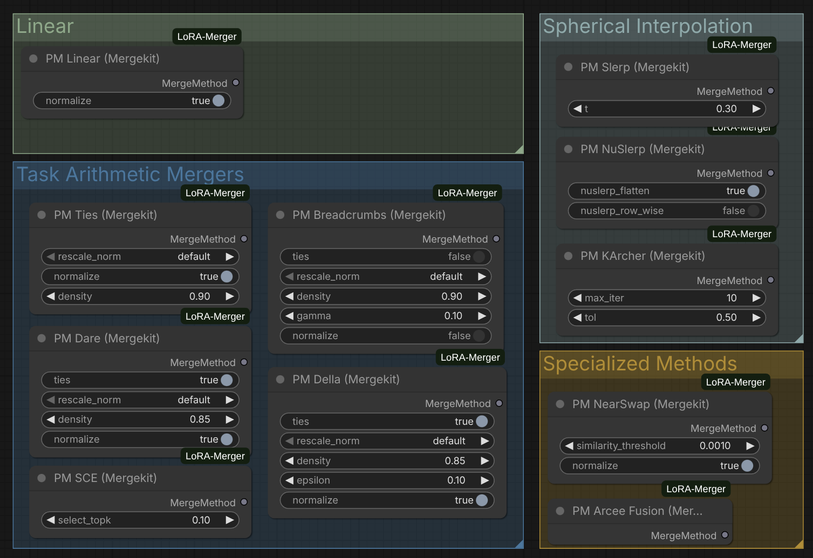

1. Stack LoRAs with **PM LoRA Stacker** or **PM LoRA Power Stacker**
2. Decompose using **PM LoRA Stack Decompose**
3. Choose a merge method (e.g., **PM TIES**, **PM DARE**)
4. Merge with **PM LoRA Merger (Mergekit)**
5. Apply with **PM LoRA Apply** or save with **PM LoRA Save**

## Node Reference

### Core Workflow Nodes

#### PM LoRA Stacker
Combine multiple LoRAs into a stack for merging. Dynamically adds connection points as you connect LoRAs.

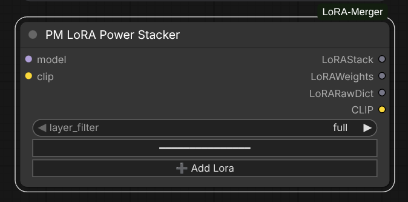

**Inputs:**
- `lora_1`, `lora_2`, ... `lora_N`: LoRABundle inputs (unlimited)

**Output:**
- `LoRAStack`: Dictionary mapping LoRA names to their patch dictionaries

#### PM LoRA Stacker (Directory)
Load all LoRAs from a directory automatically with unified strength control.

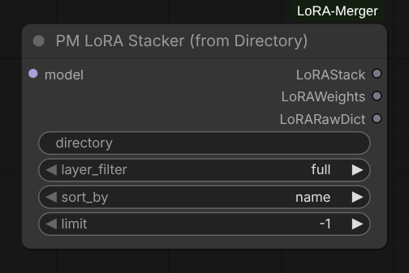

**Parameters:**
- `model`: The diffusion model the LoRAs will be applied to
- `directory`: Path to folder containing LoRA files
- `strength_model`: General model strength applied to all LoRAs (default: 1.0, range: -10.0 to 10.0)
- `strength_clip`: General CLIP strength applied to all LoRAs (default: 1.0, range: -10.0 to 10.0)
- `layer_filter`: Preset filters ("full", "attn-only", "mlp-only", "attn-mlp") for architecture-agnostic layer selection
- `sort_by`: "name", "name descending", "date", or "date descending"
- `limit`: Limit number of LoRAs to load (default: -1 for all)

**Features:**
- **Unified strength control**: Set model and CLIP strength once for all LoRAs in directory
- **Automatic loading**: No need to manually connect multiple LoRA loaders
- **Flexible sorting**: Order by filename or modification date, ascending or descending
- **Layer filtering**: Apply filters during loading for selective merging

**Outputs:**
- `LoRAStack`: Dictionary mapping LoRA names to their patch dictionaries
- `LoRAWeights`: Strength values for each LoRA
- `LoRARawDict`: Raw LoRA state dictionaries for CLIP weights


#### PM LoRA Stack Decompose
Decompose LoRA stack into (up, down, alpha) tensor components for merging.

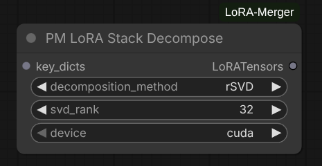

**Features:**
- **Hash-based caching**: Skips expensive decomposition if inputs unchanged
- **Architecture detection**: Automatically identifies SD vs DiT LoRAs
- **Layer filtering**: Apply preset or custom layer filters

**Parameters:**
- `key_dicts`: Input LoRAStack
- `decomposition_method`: Choose from Standard SVD, Randomized SVD, or Energy-Based Randomized SVD
- `svd_rank`: Target rank for decomposition (0 for full rank)'
- `device`: Processing device ("cpu", "cuda")

**Outputs:**
- `components`: LoRATensors (decomposed tensors by layer)

#### PM LoRA Merger (Mergekit)
Main merging node using Mergekit algorithms. Processes layers in parallel with thread-safe progress tracking.

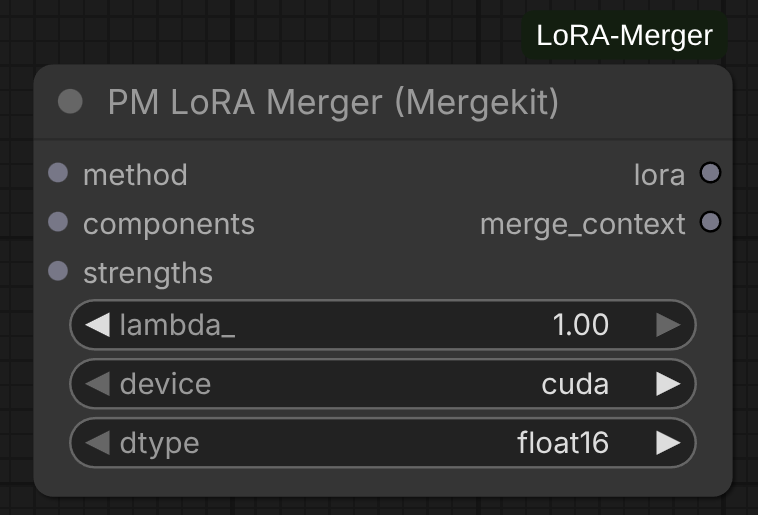

**Parameters:**
- `merge_method`: MergeMethod configuration from method nodes
- `components`: Decomposed LoRATensors from decompose node
- `strengths`: LoRAWeights from decompose node
- `_lambda`: Final scaling factor (default: 1.0)
- `device`: Processing device ("cpu", "cuda")
- `dtype`: Computation precision ("float32", "float16", "bfloat16")

**Features:**
- **Parallel processing**: ThreadPoolExecutor with max_workers=8
- **Comprehensive validation**: Input structure, tensor shapes, strength presence
- **Smart strength application**: Uses strength_model for UNet, strength_clip for CLIP layers
- **Device-aware distribution**: Balances CPU and GPU workload

**Output:**
- Merged LoRA as LoRAAdapter state dictionary

#### PM LoRA Apply
Apply merged LoRA to a model.

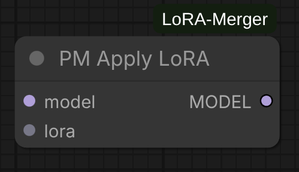

**Inputs:**
- `model`: ComfyUI model to patch
- `lora`: Merged LoRA from merger

**Outputs:**
- `model`: Patched model

#### PM LoRA Save
Save merged LoRA to disk in standard format. This will also save the original clip weights if present.

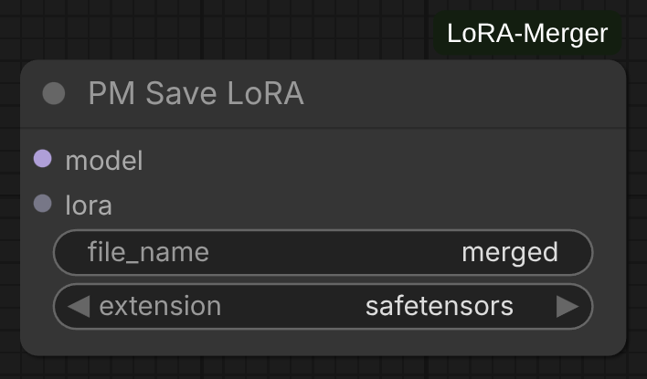

**Parameters:**
- `lora`: Merged LoRA to save
- `filename`: Output filename (without extension)

### Merge Method Nodes

Each method node configures algorithm-specific parameters. Connect to the `merge_method` input of **PM LoRA Merger**.

#### PM Linear
Simple weighted linear combination.

**Parameters:**
- `normalize` (bool): Normalize by number of LoRAs (default: True)

#### PM TIES
Task Arithmetic with Interference Elimination and Sign consensus.

**Parameters:**
- `density` (float): Fraction of values to keep (0.0-1.0, default: 0.9)
- `normalize` (bool): Normalize merged result (default: True)

**Reference:** [TIES-Merging Paper](https://arxiv.org/abs/2306.01708)

#### PM DARE
Drop And REscale for efficient model merging.

**Parameters:**
- `density` (float): Probability of keeping each parameter (default: 0.9)
- `normalize` (bool): Normalize after rescaling (default: True)

**Reference:** [DARE Paper](https://arxiv.org/abs/2311.03099)

Depth-Enhanced Low-rank adaptation with Layer-wise Averaging.

**Parameters:**
- `density` (float): Layer density parameter (default: 0.9)
- `epsilon` (float): Small value for numerical stability (default: 1e-8)
- `lambda_factor` (float): Scaling factor (default: 1.0)

#### PM Breadcrumbs
Breadcrumb-based merging strategy.

**Parameters:**
- `density` (float): Path density (default: 0.9)
- `tie_method` ("sum" or "mean"): How to combine tied parameters

#### PM SLERP
Spherical Linear Interpolation for smooth model interpolation.

**Parameters:**
- `t` (float): Interpolation factor (0.0-1.0, default: 0.5)

**Note:** SLERP requires exactly 2 LoRAs. For multiple LoRAs, use **PM NuSLERP** or **PM Karcher**.

#### PM NuSLERP
Normalized Spherical Linear Interpolation for multiple models.

**Parameters:**
- `normalize` (bool): Normalize result to unit sphere (default: True)

#### PM Karcher
Karcher mean on the manifold (generalized SLERP for N models).

**Parameters:**
- `max_iterations` (int): Maximum optimization iterations (default: 100)
- `tolerance` (float): Convergence threshold (default: 1e-6)

#### PM Task Arithmetic
Standard task vector arithmetic (delta merging).

**Parameters:**
- `normalize` (bool): Normalize by number of models (default: False)

#### PM SCE (Selective Consensus Ensemble)
Selective consensus with threshold-based parameter selection.

**Parameters:**
- `threshold` (float): Consensus threshold (default: 0.5)

#### PM NearSwap
Nearest neighbor parameter swapping.

**Parameters:**
- `distance_metric` ("cosine" or "euclidean"): Distance measure

#### PM Arcee Fusion
Arcee's proprietary fusion method for high-quality merges.

**Parameters:**
- Various advanced parameters (see node UI)

### Utility Nodes

#### PM LoRA Modifier
Apply block-wise scaling to LoRA weights for fine-grained control over different network layers.

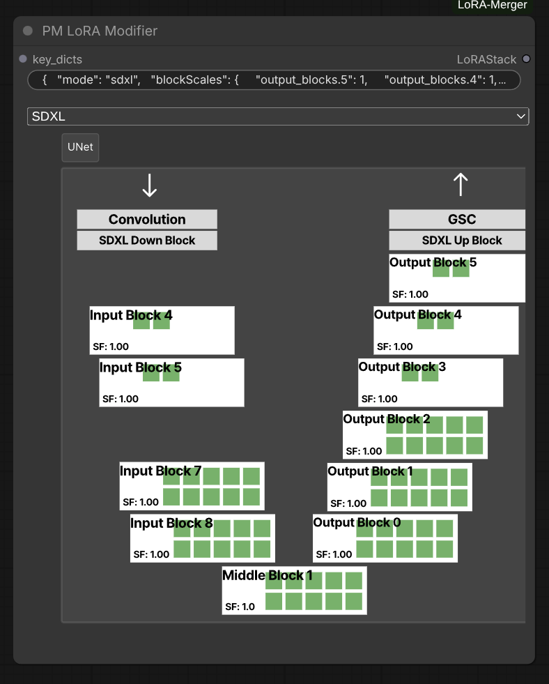

**Inputs:**
- `key_dicts`: LoRAStack to modify
- `blocks_store`: JSON string containing block scale configuration

**Features:**
- **Block-wise scaling**: Apply different scale factors to different blocks (input_blocks, middle_block, output_blocks)
- **Architecture support**: Automatically detects and handles both SD/SDXL and DiT architectures
- **Per-layer control**: Scale individual attention, MLP, or specific sub-blocks
- **Non-destructive**: Creates modified copy without altering original LoRA

**Block Scale Format:**
The `blocks_store` parameter expects a JSON string with the following structure:
```json
{
  "mode": "sdxl_unet",
  "blockScales": {
    "input_blocks.0": 1.0,
    "input_blocks.1": 0.8,
    "middle_block.1": 1.2,
    "output_blocks.0": 0.9
  }
}
```

**Supported Architectures:**
- `"sdxl_unet"`: Stable Diffusion XL UNet blocks
- `"sd_unet"`: Stable Diffusion UNet blocks
- `"dit"`: Diffusion Transformer blocks

**Use Cases:**
- **Layer-Blocked Weights (LBW)**: Implement custom block weight schemes
- **Selective emphasis**: Boost or reduce specific layer contributions
- **Fine-tuning merged results**: Adjust specific blocks after merging
- **Architecture-specific tuning**: Different scaling for different model parts

**Output:**
- Modified LoRAStack with scaled weights

#### PM LoRA Resizer
Resize all layers in a LoRA to a different rank using tensor decomposition methods.

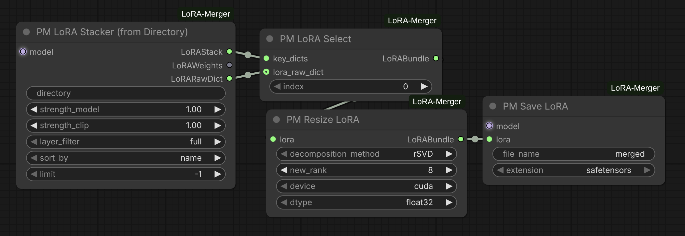

**Parameters:**
- `lora` (LoRABundle): Input LoRA to resize
- `decomposition_method`: Decomposition strategy for rank adjustment
  - `"SVD"`: Full singular value decomposition (slow but optimal)
  - `"rSVD"`: Randomized SVD (fast, recommended for most cases)
  - `"energy_rSVD"`: Energy-based randomized SVD (best for DiT/large LoRAs)
- `new_rank` (int): Target rank for all layers (default: 16, range: 1-128)
- `device`: Processing device ("cuda" or "cpu")
- `dtype`: Computation precision ("float32", "float16", "bfloat16")

**Features:**
- **Layer-by-layer processing**: Resizes each layer independently using `adjust_tensor_dims`
- **Smart optimization**: Skips layers already at target rank
- **Format compatibility**: Handles standard LoRA format (skips LoHA/LoCon and DoRA)
- **Metadata preservation**: Maintains original lora_raw (CLIP weights), strength values, and updates name to include new rank
- **Contiguous tensors**: Ensures all output tensors are contiguous for safetensors compatibility
- **Progress tracking**: Real-time progress bar during processing
- **Memory efficient**: Automatic CUDA cache cleanup after processing

**Output:**
- LoRABundle with all layers resized to target rank, named as `{original_name}_r{new_rank}`

**Use Cases:**
- Reduce LoRA file size by lowering rank
- Standardize ranks across multiple LoRAs before merging
- Fine-tune model capacity vs. quality tradeoff
- Prepare LoRAs for resource-constrained environments

**Note:** Uses asymmetric singular value distribution (all S values in up matrix), which differs from the symmetric distribution used in lora_decompose.

#### PM LoRA Block Sampler
Sample different block configurations for layer-wise experiments.

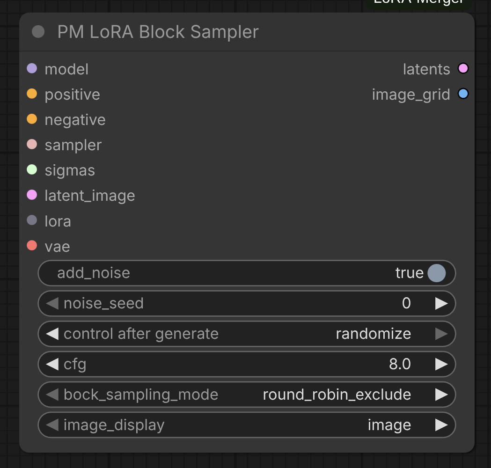

**Parameters:**
- `model`: The diffusion model the LoRAs will be applied to
- `positive`: Positive conditioning
- `negative`: Negative conditioning
- `sampler`: ComfyUI sampler to use
- `sigmas`: Sigma schedule for sampling
- `latent_image`: Initial latent image
- `lora`: LoRABundle to sample from
- `vae`: VAE model for decoding
- `add_noise`: Boolean if to add noise to latent image
- `noise_seed`: Seed for noise generation
- `control_after_generate`: Select control strategy after generation
- `block_sampling_mode`: Sampling mode for blocks ("round_robin_exclude", "round_robin_include")
- `image_display`: Whether to display generated images or display the differential image in comparison to the base image
 

#### PM LoRA Stack Sampler
Iteratively sample images using each LoRA from a stack individually, generating comparison grids.

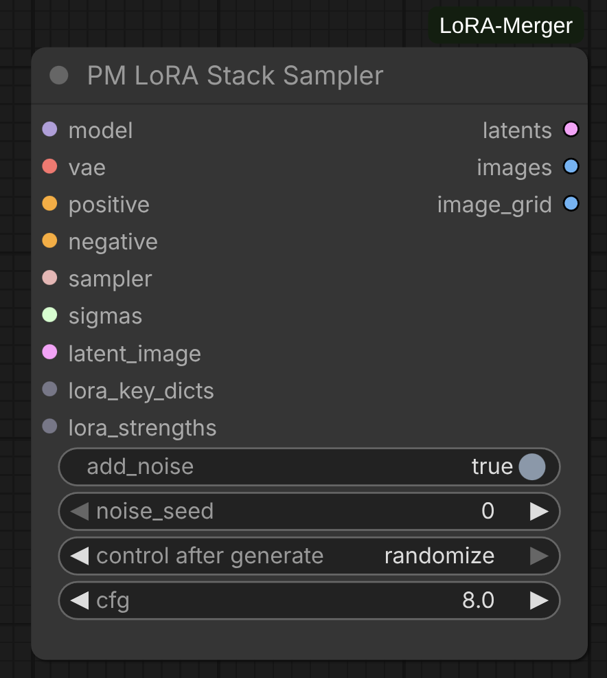

**Parameters:**
- `model`: The diffusion model the LoRAs will be applied to
- `vae`: VAE model for decoding latents to images
- `add_noise`: Whether to add noise to latent image (default: True)
- `noise_seed`: Random seed for noise generation (0 to 2^64-1)
- `cfg`: Classifier-free guidance scale (default: 8.0, range: 0.0-100.0)
- `positive`: Positive conditioning prompt
- `negative`: Negative conditioning prompt
- `sampler`: ComfyUI sampler to use (e.g., KSampler, DPM++)
- `sigmas`: Sigma schedule for noise levels
- `latent_image`: Initial latent image to denoise
- `lora_key_dicts`: LoRAStack from decompose or stacker nodes
- `lora_strengths`: LoRAWeights containing strength values for each LoRA

**Features:**
- **Individual LoRA sampling**: Applies each LoRA from the stack separately to generate comparison images
- **Automated image annotation**: Each generated image is labeled with the LoRA name and strength
- **Dual output format**:
  - Individual annotated images with LoRA metadata
  - Organized image grid (LoRAs on X-axis, batches on Y-axis)
- **Text wrapping**: Long LoRA names are automatically wrapped for readability
- **Batch support**: Handles multiple images per LoRA (batch dimension on Y-axis of grid)

**Outputs:**
- `latents`: Concatenated latents for all sampled images
- `images`: Individual annotated images as separate outputs
- `image_grid`: Combined grid view with all samples organized by LoRA and batch

**Use Cases:**
- **LoRA comparison**: Visually compare the effect of different LoRAs with identical settings
- **Stack validation**: Verify that all LoRAs in a stack are working correctly before merging
- **Style exploration**: Test multiple style LoRAs to choose the best for your project
- **Parameter tuning**: Compare LoRAs at different strength values (set in stacker node)

**Workflow Example:**
```
LoRA Stacker → LoRA Stack Decompose → LoRA Stack Sampler → Image Grid
   (3 LoRAs)                            (with model, VAE, prompts)
```

#### PM Parameter Sweep Sampler
Systematically sweep through merge parameter values to find optimal settings visually.

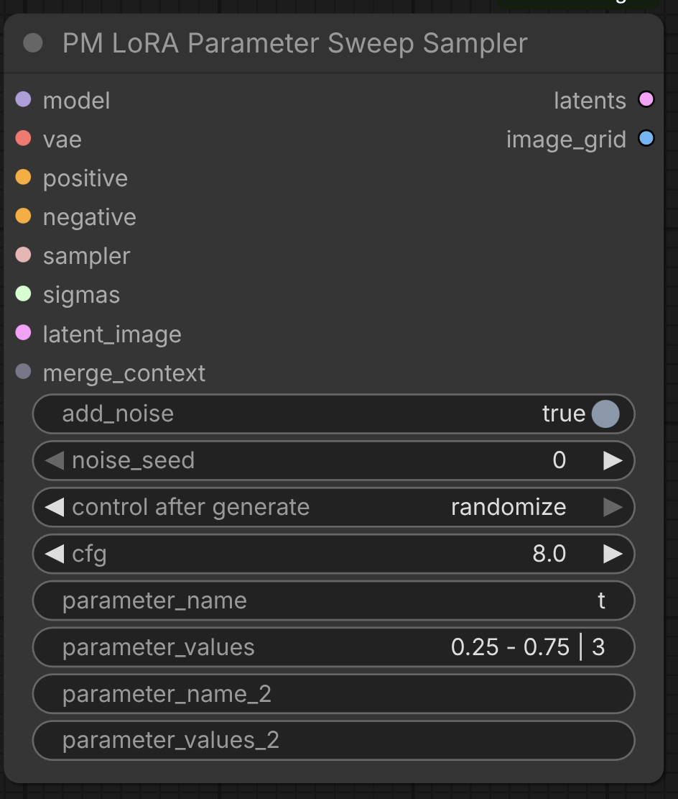

**Parameters:**
- `model`: The diffusion model the merged LoRAs will be applied to
- `vae`: VAE model for decoding latents to images
- `add_noise`: Whether to add noise to latent image (default: True)
- `noise_seed`: Random seed for noise generation (0 to 2^64-1)
- `cfg`: Classifier-free guidance scale (default: 8.0, range: 0.0-100.0)
- `positive`: Positive conditioning prompt
- `negative`: Negative conditioning prompt
- `sampler`: ComfyUI sampler to use
- `sigmas`: Sigma schedule for noise levels
- `latent_image`: Initial latent image to denoise
- `merge_context`: MergeContext output from **PM LoRA Merger (Mergekit)** node
- `parameter_name`: Name of the merge parameter to sweep (e.g., "t", "density", "normalize")
- `parameter_values`: Parameter values to test (see formats below)
- `parameter_name_2`: Optional second parameter for 2D sweeps (leave empty for 1D)
- `parameter_values_2`: Second parameter values (same formats as parameter_values)

**Parameter Value Formats:**
The `parameter_values` and `parameter_values_2` fields support multiple input formats:

1. **Linspace format**: `"min - max | num_points"`
   - Example: `"0.25 - 0.75 | 3"` → [0.25, 0.5, 0.75]
   - Evenly spaces num_points between min and max

2. **Step format**: `"min - max : step"`
   - Example: `"0.25 - 0.75 : 0.25"` → [0.25, 0.5, 0.75]
   - Increments from min to max by step size

3. **Explicit format**: `"val1, val2, val3"`
   - Example: `"0.25, 0.5, 0.75"` → [0.25, 0.5, 0.75]
   - Comma-separated list of specific values

4. **Single value**: `"0.5"`
   - Example: `"0.5"` → [0.5]
   - Tests a single parameter value

5. **Boolean parameters**: Auto-detected
   - If parameter is boolean (e.g., "normalize"), automatically uses [False, True]
   - `parameter_values` input is ignored for boolean parameters

**Features:**
- **Single parameter mode**: Sweep one parameter across multiple values (1D grid)
- **Dual parameter mode**: Sweep two parameters for n × m comparison (2D grid)
- **Automatic boolean handling**: Boolean parameters auto-expand to [False, True]
- **Image annotation**: Each sample labeled with parameter name and value(s)
- **Progress tracking**: Real-time progress bar shows overall completion
- **Safety limits**: Maximum 64 images to prevent excessive computation
- **Merge method agnostic**: Works with any merge method (SLERP, TIES, DARE, etc.)

**Outputs:**
- `latents`: Stacked latents for all parameter combinations
- `image_grid`: Annotated comparison grid (horizontal for 1D, rows×cols for 2D)

**Use Cases:**

**SLERP Interpolation Sweep:**
```
parameter_name: "t"
parameter_values: "0.0 - 1.0 | 5"
→ Tests t=[0.0, 0.25, 0.5, 0.75, 1.0] to find optimal interpolation point
```

**TIES Density Optimization:**
```
parameter_name: "density"
parameter_values: "0.5, 0.7, 0.9"
→ Compares sparse (0.5), medium (0.7), and dense (0.9) merges
```

**DARE Drop Rate Analysis:**
```
parameter_name: "density"
parameter_values: "0.5 - 0.95 : 0.15"
→ Tests density=[0.5, 0.65, 0.8, 0.95] to balance efficiency vs quality
```

**Boolean Parameter Testing:**
```
parameter_name: "normalize"
parameter_values: "" (ignored)
→ Automatically tests [False, True] to compare normalized vs unnormalized
```

**2D Parameter Sweep (Dual Mode):**
```
parameter_name: "density"
parameter_values: "0.5, 0.7, 0.9"
parameter_name_2: "k"
parameter_values_2: "16, 32, 64"
→ Generates 3 × 3 = 9 images testing all combinations
```

**Workflow Example:**
```
LoRA Stack → Decompose → Method Node (SLERP) → Merger (with MergeContext output)
                                                     ↓
                                              Parameter Sweep Sampler
                                              (sweep "t" from 0 to 1)
                                                     ↓
                                              Annotated Image Grid
```

**Notes:**
- Use MergeContext output from **PM LoRA Merger (Mergekit)** instead of the LoRA output
- Each parameter combination creates a new merge + sampling operation
- Parameter names must match the merge method's settings (check method node inputs)
- For invalid parameter names, the node provides a list of available parameters in the error message
- 2D sweeps create grids where rows = first parameter values, columns = second parameter values

### Power Stacker Node

#### PM LoRA Power Stacker
Advanced stacking with per-LoRA configuration and dynamic input management.


**Features:**
- **Dynamic LoRA inputs**: Add unlimited LoRAs with individual strength controls via widget UI
- **Built-in search**: Click on any LoRA name to open a searchable dropdown list
- **Per-LoRA strengths**: Separate strength_model and strength_clip for each LoRA
- **Architecture detection**: Automatically identifies SD vs DiT LoRAs
- **Layer filtering**: Architecture-agnostic preset filters (full, attn-only, mlp-only, attn-mlp)
- **CLIP integration**: Automatically applies all LoRAs to CLIP model and preserves CLIP weights in outputs

**Usage:**
- Click "➕ Add Lora" to add a new LoRA slot
- Click on the LoRA name field to open a searchable list of available LoRAs
- Type to filter the list in real-time
- Toggle individual LoRAs on/off with the checkbox

## SVD and Decomposition

The project includes a comprehensive tensor decomposition system with multiple strategies:

### Decomposition Methods

#### Standard SVD
Full singular value decomposition for exact low-rank approximation.

**Use case:** High accuracy, small to medium tensors

#### Randomized SVD
Fast approximate SVD using randomized linear algebra.

**Use case:** Large tensors where speed is critical

#### Energy-Based Randomized SVD
Adaptive SVD that automatically selects rank based on energy threshold.

**Use case:** Automatic rank selection with quality guarantees

### Error Handling

All decomposers include:
- **GPU failure fallback**: Automatically retries on CPU if GPU decomposition fails
- **Zero matrix detection**: Gracefully handles degenerate cases
- **Shape validation**: Automatic reshape for 2D/3D/4D tensors (conv and linear layers)
- **Numerical stability**: Epsilon regularization for near-singular matrices

## Layer Filtering

Selective merging allows targeting specific layer types with architecture-agnostic presets that work seamlessly with both Stable Diffusion and DiT (Diffusion Transformer) LoRAs.

### Preset Filters

- **`"full"`**: All layers (no filter)
- **`"attn-only"`**: Only attention layers
  - SD: attn1, attn2
  - DiT: attention
- **`"mlp-only"`**: Only MLP/feedforward layers
  - SD: ff
  - DiT: mlp, feed_forward
- **`"attn-mlp"`**: Attention + MLP layers combined
  - SD: attn1, attn2, ff
  - DiT: attention, mlp, feed_forward

### Custom Filters

You can also create custom filters by providing a set of layer component names:
```python
from src.utils import LayerFilter
filter = LayerFilter({"attn1", "proj_in", "proj_out"})
filtered_patches = filter.apply(lora_patches)
```

**Use Cases:**
- **Style transfer**: Use `"attn-only"` to merge only attention mechanisms for composition/style
- **Detail merging**: Use `"mlp-only"` to merge only feedforward layers for textures/details
- **Balanced merging**: Use `"attn-mlp"` to exclude projection and normalization layers
- **Full merge**: Use `"full"` to merge all layer types

## Architecture Support

### Stable Diffusion LoRAs
Automatic detection and handling of:
- **UNet blocks**: Input, middle, output blocks
- **Attention layers**: attn1 (self-attention), attn2 (cross-attention)
- **Feed-forward**: ff.net layers
- **CLIP text encoder**: text_model layers

### DiT (Diffusion Transformer) LoRAs
Automatic layer grouping for:
- **Joint blocks**: Unified transformer blocks
- **Attention**: Multi-head attention layers
- **MLP**: Feed-forward networks
- **Positional encoding**: Learned position embeddings

The system automatically detects architecture and applies appropriate decomposition strategies.


## License

MIT License

Copyright (c) 2024 LoRA Power-Merger Contributors

Permission is hereby granted, free of charge, to any person obtaining a copy
of this software and associated documentation files (the "Software"), to deal
in the Software without restriction, including without limitation the rights
to use, copy, modify, merge, publish, distribute, sublicense, and/or sell
copies of the Software, and to permit persons to whom the Software is
furnished to do so, subject to the following conditions:

The above copyright notice and this permission notice shall be included in all
copies or substantial portions of the Software.

THE SOFTWARE IS PROVIDED "AS IS", WITHOUT WARRANTY OF ANY KIND, EXPRESS OR
IMPLIED, INCLUDING BUT NOT LIMITED TO THE WARRANTIES OF MERCHANTABILITY,
FITNESS FOR A PARTICULAR PURPOSE AND NONINFRINGEMENT. IN NO EVENT SHALL THE
AUTHORS OR COPYRIGHT HOLDERS BE LIABLE FOR ANY CLAIM, DAMAGES OR OTHER
LIABILITY, WHETHER IN AN ACTION OF CONTRACT, TORT OR OTHERWISE, ARISING FROM,
OUT OF OR IN CONNECTION WITH THE SOFTWARE OR THE USE OR OTHER DEALINGS IN THE
SOFTWARE.

## Credits

- Original LoRA Merger by [laksjdjf](https://github.com/laksjdjf/LoRA-Merger-ComfyUI)
- Mergekit by [Arcee AI](https://github.com/arcee-ai/mergekit)
- TIES-Merging: [Paper](https://arxiv.org/abs/2306.01708)
- DARE: [Paper](https://arxiv.org/abs/2311.03099)
- ComfyUI by [comfyanonymous](https://github.com/comfyanonymous/ComfyUI)
